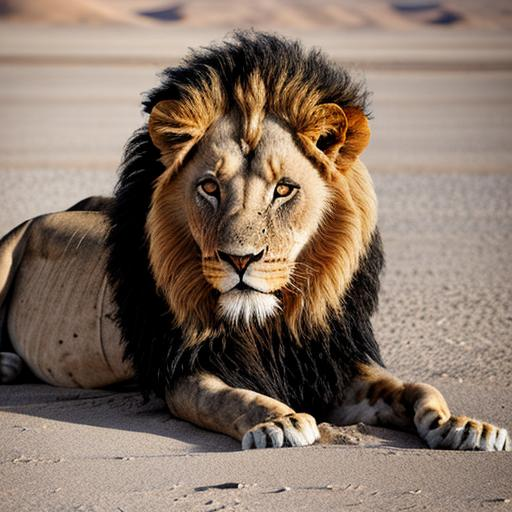

  
  <h1>mwezi</h1>

  
<i>mwezi</i>

---

<h4>Documentation</h4>

---

## Introduction

mwezi images DVM

In honour of Mwezi the [last](https://snort.social/nevent1qqsrqlp7apwlfugxzu84gr9h4kzumzupecke570zlkr23w7jz34hhrcpz3mhxue69uhhyetvv9ukzcnvv5hx7un89upzpnlrksckmyznxkmvuptt5rkzxz6c0ge58q0g90u6q2scfuksdrudqvzqqqqqqyt6wtr4) black mained desert lion.

## License

- MIT
